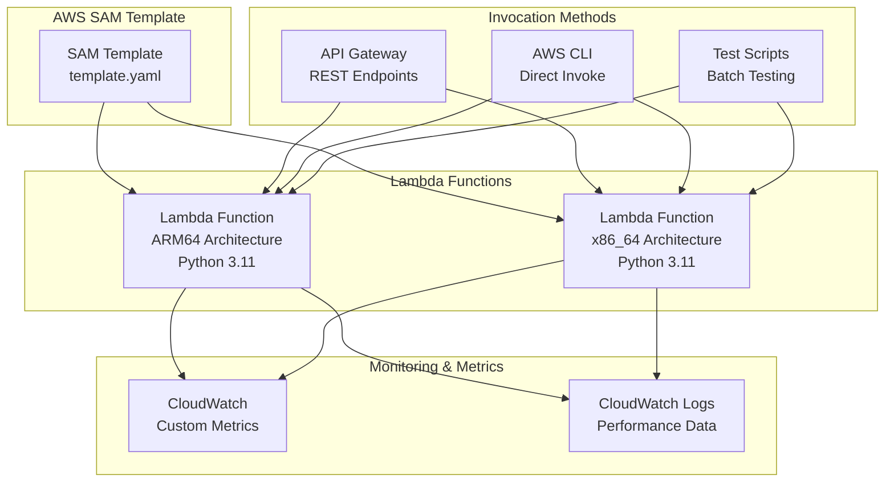
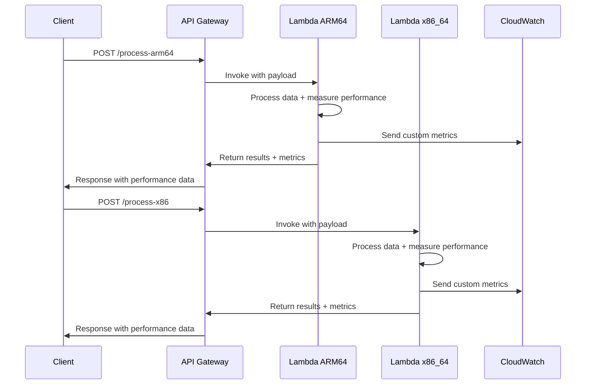

# Design Document

## Overview

This design implements a Lambda-based data processing solution to compare performance between ARM64 and x86_64 architectures using Python 3.11. The solution uses AWS SAM for infrastructure as code, ensuring consistent deployment and configuration across both architectures. The system will process computational workloads and capture detailed performance metrics for comparison analysis.

## Architecture

### High-Level Architecture



### Data Processing Flow



## Components and Interfaces

### 1. SAM Template Structure

**File**: `template.yaml`
- Defines two identical Lambda functions with different architectures
- Configures API Gateway endpoints for HTTP invocation
- Sets up IAM roles and permissions
- Defines CloudWatch custom metrics permissions

### 2. Lambda Function Code

**File**: `src/lambda_function.py`
- Single codebase shared between both architectures
- Implements data processing logic using Python 3.11 features
- Captures performance metrics (execution time, memory usage)
- Handles both API Gateway and direct invocation events

### 3. Data Processing Module

**File**: `src/data_processor.py`
- Contains computational workloads for performance testing
- Implements various algorithms (sorting, mathematical computations, string processing)
- Designed to stress both CPU and memory to highlight architecture differences

### 4. Performance Metrics Module

**File**: `src/metrics.py`
- Captures execution time with high precision
- Monitors memory usage during processing
- Sends custom metrics to CloudWatch
- Formats performance data for consistent output

### 5. Test Utilities

**File**: `tests/performance_test.py`
- Automated testing scripts for batch invocation
- Generates test data sets of varying sizes
- Collects and aggregates performance results
- Provides statistical analysis of performance differences

## Data Models

### Input Event Schema

```python
{
    "operation": str,  # Type of data processing operation
    "data_size": int,  # Size of data to process (for scaling tests)
    "iterations": int, # Number of iterations to run
    "payload": dict    # Actual data to process
}
```

### Performance Metrics Schema

```python
{
    "architecture": str,        # "arm64" or "x86_64"
    "operation": str,          # Operation performed
    "execution_time_ms": float, # Total execution time
    "memory_used_mb": float,   # Peak memory usage
    "cold_start": bool,        # Whether this was a cold start
    "data_size": int,          # Size of processed data
    "iterations": int,         # Number of iterations
    "timestamp": str,          # ISO timestamp
    "function_version": str    # Lambda function version
}
```

### Response Schema

```python
{
    "result": dict,            # Processing results
    "performance": dict,       # Performance metrics
    "metadata": {
        "architecture": str,
        "runtime": str,
        "function_name": str
    }
}
```

## Error Handling

### Lambda Function Error Handling

1. **Input Validation Errors**
   - Validate required fields in event payload
   - Return HTTP 400 with descriptive error messages
   - Log validation errors for debugging

2. **Processing Errors**
   - Wrap data processing in try-catch blocks
   - Return HTTP 500 with error details
   - Capture error metrics for monitoring

3. **Memory/Timeout Errors**
   - Configure appropriate memory and timeout settings
   - Implement graceful degradation for large datasets
   - Log resource constraint errors

### Infrastructure Error Handling

1. **Deployment Errors**
   - Validate SAM template syntax
   - Handle CloudFormation stack failures
   - Provide rollback mechanisms

2. **Permission Errors**
   - Define minimal required IAM permissions
   - Handle CloudWatch metrics publishing failures
   - Graceful degradation when metrics can't be sent

## Testing Strategy

### Unit Testing

1. **Data Processing Logic**
   - Test individual processing functions
   - Validate output correctness
   - Test edge cases and error conditions

2. **Metrics Collection**
   - Test performance measurement accuracy
   - Validate metric formatting and structure
   - Test CloudWatch integration

### Integration Testing

1. **Lambda Function Testing**
   - Use SAM CLI local testing capabilities
   - Test with various input payloads
   - Validate end-to-end processing flow

2. **API Gateway Integration**
   - Test HTTP endpoints
   - Validate request/response formats
   - Test error handling through API

### Performance Testing

1. **Baseline Performance**
   - Establish performance baselines for both architectures
   - Test with various data sizes and complexity
   - Measure cold start vs warm start performance

2. **Comparative Analysis**
   - Run identical workloads on both architectures
   - Collect statistical samples for analysis
   - Generate performance comparison reports

### Load Testing

1. **Concurrent Invocations**
   - Test multiple simultaneous invocations
   - Measure scaling behavior
   - Validate performance under load

2. **Sustained Load**
   - Test performance over extended periods
   - Monitor for performance degradation
   - Validate memory leak prevention

## Implementation Considerations

### Python 3.11 Features

- Utilize enhanced error messages for better debugging
- Leverage performance improvements in string operations
- Use structural pattern matching for cleaner code
- Take advantage of faster startup times

### Architecture-Specific Optimizations

- Design workloads that can benefit from ARM64's efficiency
- Include both integer and floating-point intensive operations
- Test memory bandwidth differences between architectures
- Consider instruction set differences in algorithm selection

### Monitoring and Observability

- Implement structured logging for easy analysis
- Use CloudWatch custom metrics for real-time monitoring
- Create dashboards for performance visualization
- Set up alerts for performance anomalies

### Cost Optimization

- Configure appropriate memory settings for each architecture
- Use provisioned concurrency only when necessary for testing
- Implement efficient data structures to minimize memory usage
- Consider cost implications of different architectures